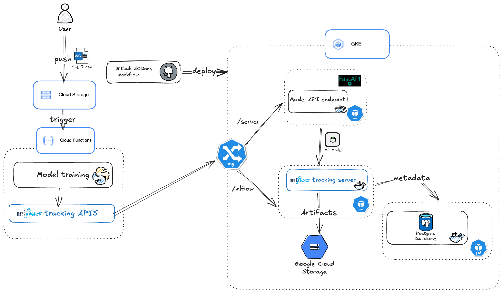

# Predicting Temperature

## About

This is an end-to-end machine learning project that predicts the mean temperature in degrees Celsius using supervised learning techniques. The idea of this project comes from DataCamp platform [(link)](https://app.datacamp.com/learn/projects/predicting_temperature_in_london).
The project includes data preprocessing, model training, evaluation and model deployment in Production.


## Table of Contents
- [Architecture](#architecture)
- [Technologies Used](#technologies-used)
- [Setup Instructions](#setup-instructions)
- [Usage](#usage)


## Architecture
Below is the architecture diagram that illustrates the workflow of the project from data cleaning to model deployment in production


## Technologies Used
- Docker
- Kubernetes
- DVC
- GitHub Actions
- GCP Cloud Functions
- FastAPI
- MLflow

## Setup Instructions

## Usage
Once the application is deployed, you can interact with the API via FastAPI.

To predict the mean tempreature, send a POST request to the /DecisionTreeRegressor, /LinearRegression or /RandomForestRegressor endpoints with the appropriate data.

Example:
```bash
{
   "month":1,
    "cloud_cover": 2.0,
    "sunshine": 7.0,
    "precipitation": 0.4,
    "pressure": 101900.0,
    "global_radiation": 52.0
}
```